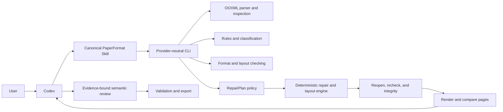

# PaperFormat AI architecture

Status: public v0.8 architecture
Updated: 2026-08-25

## 1. Product boundary

PaperFormat is a deterministic document toolchain driven by Codex. The Skill
and CLI are the product; there is no Web or server-side model workflow.

The boundary is:

> The Agent provides intelligence. PaperFormat provides tools, constraints,
> deterministic mutation, rendering, and proof.

The core runs without Web, API, Docker, or a model credential.

## 2. System context



## 3. Responsibilities

### Agent

- interpret user intent and file roles;
- reason about semantic document structure;
- read rules, issues, risks, and rendered pages;
- create typed ordered plans;
- explain risk and obtain approval;
- perform semantic visual review;
- re-plan after failed gates.

### PaperFormat

- safely parse DOCX/DOTX and resolve effective formatting;
- derive transparent rules and classify supported elements;
- produce deterministic issues and layout risks;
- validate plan identity, dependencies, levels, and permissions;
- mutate only copied candidates using allow-listed operations;
- reopen, Open XML validate, post-check, and compare integrity;
- render pages and detect deterministic anomalies;
- bind semantic review to exact evidence;
- export complete proof only after every gate passes.

### Prohibited

Neither Codex nor an untrusted proposal may directly rewrite DOCX, freely
mutate OOXML, overwrite source files, change semantic content, or bypass final
gates.

## 4. Core dependency direction

```text
Domain
  <- OpenXml / Rules / Classification / Checking / Layout
  <- Repair / Integrity / Reporting / Rendering / Agent-plan policy
  <- Cli
```

The CLI depends only on core libraries. It has no HTTP, database, storage,
frontend, or model-provider dependency.

## 5. Processing pipeline

1. Copy the source into a new task and record SHA-256.
2. Run bounded OOXML preflight and structural inspection.
3. derive a built-in or template-based RulePackage.
4. Classify manuscript elements with confidence and evidence.
5. Check effective formatting and analyze layout risks.
6. Let the Agent inspect structured artifacts and rendered evidence.
7. Validate its RepairPlan v2 against exact current candidates.
8. Execute Safe operations and explicitly approved Review operations on a new
   candidate.
9. Reopen and validate OOXML; rerun classification and checks.
10. Compare content-bearing structures and hashes.
11. Render before/after pages and run deterministic comparison.
12. Bind Agent visual review to plan, operation, hashes, and page counts.
13. Run final validation and export only when no gate remains.

## 6. Execution levels

### Safe

Bounded deterministic character and paragraph formatting with known values and
locations. Safe is not exempt from validation.

### Advisory

Non-executable evidence, including ambiguous classification that no supported
structural operation depends on. Advisory findings do not block unrelated Safe
formatting.

### Review

Page geometry, section breaks, columns, broad layout, and other changes whose
visual impact requires exact user approval.

### Experimental

Ambiguous or high-risk document topology and object layout. Ordinary `apply`
cannot execute Experimental operations. An isolated attempt protocol must keep
all evidence and cannot produce a ready export without every normal gate.

## 7. IEEE layout model

The layout analyzer identifies the semantic front-matter/body boundary and
object risks. The converter can insert continuous or next-page section breaks
and set exact section columns. Section-start semantics are applied to the
following section as required by WordprocessingML.

The contextual checker evaluates body column rules only in body sections, so a
full-width title/author/abstract region can coexist with a double-column body.

Wide tables, merged tables, drawings, equations, and fields remain separate
Review or Experimental decisions; they are never silently rearranged.

## 8. Integrity and visual proof

Integrity snapshots cover normalized text, paragraph sequence, tables and
geometry, media hashes, equations, hyperlinks, bookmarks, fields, notes,
headers/footers, numbering, and section topology.

An explicitly approved section-topology change may pass as planned. That
allowance does not permit any other content change.

Page comparison detects page-count, dimensions, pixel changes, large new blank
regions, and near-empty pages. Semantic review checks title hierarchy, object
appearance, indents, columns, clipping, overlap, and unexplained pagination.

## 9. Surfaces

### Primary

- `plugins/paperformat-ai/scripts/paperformat` and
  `plugins/paperformat-ai/src/PaperFormat.Cli`;
- concise `plugins/paperformat-ai/skills/paperformat/SKILL.md` plus
  progressively loaded `references/`, Skill-owned `scripts/`, and governed
  `assets/templates/`;
- versioned repository schemas;
- caller-selected task and export directories outside the immutable source.

The template registry is empty in the public release. If a redistributable
asset is added later, the registry must bind it to a complete target identity,
immutable hash, provenance, selection policy, and governance state. It never
performs family-level fallback. A selected task-local template remains a rule
source: supported rules are derived at runtime by the same deterministic core.

## 10. Completion rule

A generated DOCX is only a candidate. It becomes ready only after source
preservation, plan policy, apply, reopen, OOXML validation, post-check,
integrity, page comparison, evidence-bound visual review, final validation,
and ready export all pass.
